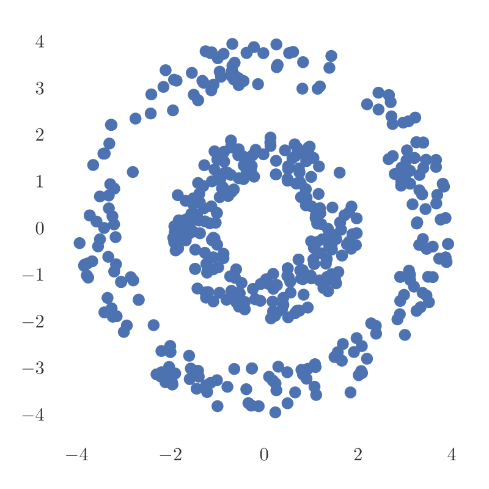
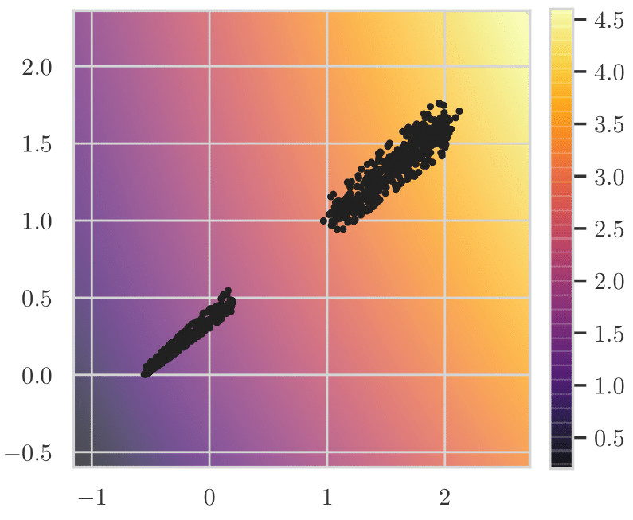
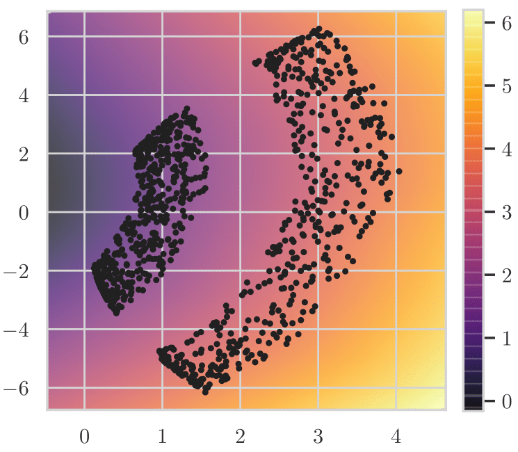
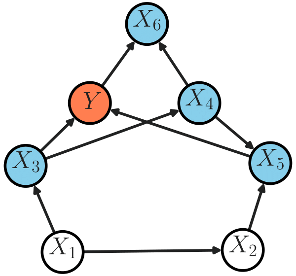

# model-augmented-mutual-information

This repository contains code related to the paper "Model-Augmented Conditional Mutual Information Estimation for Feature Selection," which appeared at the 2020 Conference on Uncertainty in Artificial Intelligence (UAI) [[Link]](https://arxiv.org/abs/1911.04628).

The code in this repository depends on [```pycit```](https://github.com/syanga/pycit), which can be installed using pip:
```
pip install pycit
```


# Experiments

## 1. Improving the Performance of k-NN Mutual Information Estimator 

This experiment shows how a learned mapping can improve the performance of the k-NN mutual information (MI) estimator. We have a random variable X which is sampled uniformly on two concentric rings; a scatterplot of 500 samples is shown below:



Let Y be the magnitude of X plus noise. The goal is to estimate I(X;Y), the MI between X and Y. The samples of X are spread across two rings instead of just along a single axis, which makes k-NN MI estimation more difficult. Therefore, before using the k-NN estimator, we would like to learn a mapping of X that looks more like:



as opposed to:



We learn this mapping with a regularization term that maps values of X with similar information about Y (in this case, similar magnitudes) close together. This is done in the IPython notebook [```bullseye2d_experiment.ipynb```](bullseye2d_experiment.ipynb).


## 2. Conditional Independence Testing

In this experiment, we evaluate the performance of the k-NN based conditional independence test (CIT) on a 3D version of the Bullseye data, where the variables' distribution is faithful to the DAG structure:



Here, the features are 3-dimensional, and the target variable Y is a scalar. The Markov blanket of Y is highlighted in blue. We find that the k-NN test is not able to correctly find the Markov blanket (parents, children, and co-parents of Y) using a PC-type algorithm (see [```pycit```](https://github.com/syanga/pycit) documentation, and Algorithm 2 in our [paper](https://arxiv.org/abs/1911.04628)). However, using samples of a learned feature mapping allowed the k-NN method to succeed. The code for this experiment is in the IPython notebook [```bullseye3d_experiment.ipynb```](bullseye3d_experiment.ipynb).


