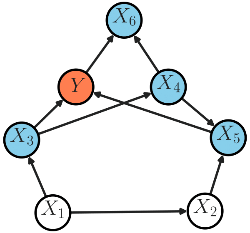

# Examples

## CI Testing

In this example, the ```itest()``` and ```citest()``` functions are used to perform independence testing for additive Gaussian variables. The example can be run by calling:
```python
python gaussian_channels.py
```
in the ```examples``` directory.

Example output:
```python
Example: Independent variables
  Declared independent: True, p-value: 0.997
Example: Dependent variables
  Declared independent: False, p-value: 0.000
Example: Conditionally independent variables
  Declared independent: True, p-value: 0.634
Example: Conditionally dependent variables
  Declared independent: False, p-value: 0.001
```
## Markov Blanket Discovery

In this example, the MarkovBlanket class is used to find the Markov blanket of the target variable ```Y```. The ground truth structure is:



Therefore, the true Markov blanket is ```X_3, X_4, X_5, X_6```. The variables follow a linear Gaussian model. The example can be run by calling:
```python
python gaussian_network.py
```
in the ```examples``` directory.

Example output:
```python
==========Finding Adjacents...==========
Testing X_{6}
  Cond. set: []
    Is CI: False, pval: 0.000
Testing X_{2}
  Cond. set: []
    Is CI: False, pval: 0.000
Testing X_{5}
  Cond. set: []
    Is CI: False, pval: 0.000
Testing X_{1}
  Cond. set: []
    Is CI: False, pval: 0.000
Testing X_{3}
  Cond. set: []
    Is CI: False, pval: 0.000
Testing X_{4}
  Cond. set: []
    Is CI: False, pval: 0.000
Testing X_{6}
  Cond. set: ['X_{5}']
    Is CI: False, pval: 0.000
  Cond. set: ['X_{1}']
    Is CI: False, pval: 0.000
  Cond. set: ['X_{3}']
    Is CI: False, pval: 0.000
  Cond. set: ['X_{2}']
    Is CI: False, pval: 0.000
  Cond. set: ['X_{4}']
    Is CI: False, pval: 0.000
Testing X_{2}
  Cond. set: ['X_{4}']
    Is CI: False, pval: 0.000
  Cond. set: ['X_{6}']
    Is CI: False, pval: 0.000
  Cond. set: ['X_{1}']
    Is CI: False, pval: 0.002
  Cond. set: ['X_{5}']
    Is CI: False, pval: 0.000
  Cond. set: ['X_{3}']
    Is CI: False, pval: 0.000
Testing X_{5}
  Cond. set: ['X_{2}']
    Is CI: False, pval: 0.000
  Cond. set: ['X_{6}']
    Is CI: False, pval: 0.000
  Cond. set: ['X_{3}']
    Is CI: False, pval: 0.000
  Cond. set: ['X_{1}']
    Is CI: False, pval: 0.000
  Cond. set: ['X_{4}']
    Is CI: False, pval: 0.000
Testing X_{1}
  Cond. set: ['X_{2}']
    Is CI: False, pval: 0.000
  Cond. set: ['X_{5}']
    Is CI: False, pval: 0.000
  Cond. set: ['X_{3}']
    Is CI: False, pval: 0.000
  Cond. set: ['X_{4}']
    Is CI: False, pval: 0.000
  Cond. set: ['X_{6}']
    Is CI: False, pval: 0.000
Testing X_{3}
  Cond. set: ['X_{1}']
    Is CI: False, pval: 0.000
  Cond. set: ['X_{6}']
    Is CI: False, pval: 0.000
  Cond. set: ['X_{4}']
    Is CI: False, pval: 0.000
  Cond. set: ['X_{5}']
    Is CI: False, pval: 0.000
  Cond. set: ['X_{2}']
    Is CI: False, pval: 0.000
Testing X_{4}
  Cond. set: ['X_{1}']
    Is CI: False, pval: 0.000
  Cond. set: ['X_{3}']
    Is CI: False, pval: 0.000
  Cond. set: ['X_{6}']
    Is CI: False, pval: 0.000
  Cond. set: ['X_{5}']
    Is CI: False, pval: 0.000
  Cond. set: ['X_{2}']
    Is CI: False, pval: 0.000
Testing X_{6}
  Cond. set: ['X_{1}', 'X_{3}']
    Is CI: False, pval: 0.000
  Cond. set: ['X_{3}', 'X_{4}']
    Is CI: False, pval: 0.000
  Cond. set: ['X_{1}', 'X_{2}']
    Is CI: False, pval: 0.000
  Cond. set: ['X_{2}', 'X_{4}']
    Is CI: False, pval: 0.000
  Cond. set: ['X_{1}', 'X_{5}']
    Is CI: False, pval: 0.000
  Cond. set: ['X_{1}', 'X_{4}']
    Is CI: False, pval: 0.000
  Cond. set: ['X_{3}', 'X_{5}']
    Is CI: False, pval: 0.000
  Cond. set: ['X_{2}', 'X_{3}']
    Is CI: False, pval: 0.000
  Cond. set: ['X_{4}', 'X_{5}']
    Is CI: False, pval: 0.000
  Cond. set: ['X_{2}', 'X_{5}']
    Is CI: False, pval: 0.000
Testing X_{2}
  Cond. set: ['X_{4}', 'X_{6}']
    Is CI: False, pval: 0.000
  Cond. set: ['X_{1}', 'X_{5}']
    Is CI: True, pval: 0.060
Testing X_{5}
  Cond. set: ['X_{1}', 'X_{4}']
    Is CI: False, pval: 0.000
  Cond. set: ['X_{1}', 'X_{6}']
    Is CI: False, pval: 0.000
  Cond. set: ['X_{3}', 'X_{6}']
    Is CI: False, pval: 0.000
  Cond. set: ['X_{4}', 'X_{6}']
    Is CI: False, pval: 0.000
  Cond. set: ['X_{3}', 'X_{4}']
    Is CI: False, pval: 0.000
  Cond. set: ['X_{1}', 'X_{3}']
    Is CI: False, pval: 0.000
Testing X_{1}
  Cond. set: ['X_{3}', 'X_{5}']
    Is CI: True, pval: 0.308
Testing X_{3}
  Cond. set: ['X_{4}', 'X_{5}']
    Is CI: False, pval: 0.000
  Cond. set: ['X_{5}', 'X_{6}']
    Is CI: False, pval: 0.000
  Cond. set: ['X_{4}', 'X_{6}']
    Is CI: False, pval: 0.000
Testing X_{4}
  Cond. set: ['X_{3}', 'X_{5}']
    Is CI: True, pval: 0.150
Testing X_{6}
Testing X_{5}
Testing X_{3}
Testing X_{6}
Testing X_{5}
Testing X_{3}
Testing X_{6}
Testing X_{5}
Testing X_{3}
Adjacents found: ['X_{3}', 'X_{5}', 'X_{6}']
==========Finding Coparents...==========
Testing X_{4}
    Is dependent: True, pval: 0.000
Testing X_{1}
    Is dependent: False, pval: 0.948
Testing X_{2}
    Is dependent: False, pval: 0.536
Discovered Markov blanket: ['X_{3}', 'X_{4}', 'X_{5}', 'X_{6}']
```